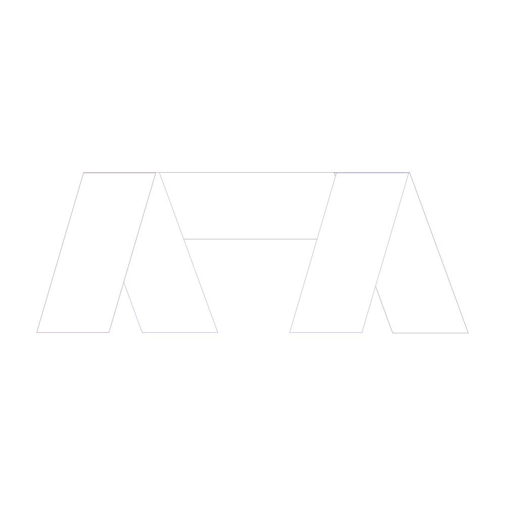

<div style="text-align: center;">

   
## AnimVanish
Plugin that provides large library of pre-made effects to your vanish with support for SuperVanish and PremiumVanish

<a href="https://papermc.io/">
     
    </a>
    <a href="https://github.com/ArikSquad/AnimVanish/blob/master/LICENSE">
        
    </a>
    <a href="https://www.patreon.com/ariksquad">
        
    </a>
</div>

Remember to go check SuperVanish and PremiumVanish!
Our plugin makes your vanishing look great with a large library of pre-made effects on your vanish.

### Current library of effects:
- Lightning effect (Lightning strike and optional night)
- Particle effect
- TNT effect
- NPC effect (requires Citizens)
- Zombie effect
- Blindness effect
- Sound effect
- Turn effect
- Firework effect
- Blood effect

## Configuration
You can find all about the configuration in the [wiki](https://github.com/ArikSquad/AnimVanish/wiki/Configuration)

## Permissions
For more in-depth information about permissions, please visit the [wiki](https://github.com/ArikSquad/AnimVanish/wiki/Permissions)
```yml
animvanish.* - All permissions in one
animvanish.invis - This permission allows vanishing with effects
animvanish.invis.other - This permission allows vanishing other players
animvanish.invis.gui - This permission allows opening the GUI
animvanish.invis.[effect] - This permissions allows vanishing with a specific effect
animvanish.reload - This permission can reload the plugin
animvanish.help - This permissions can see help for the plugin 
```


Planned Features
-------
| Feature name    | Status | 
|-----------------|--------|
| Mod Integration |        |
| Built-in Vanish |        |

